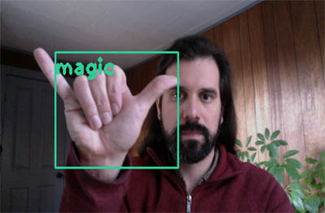
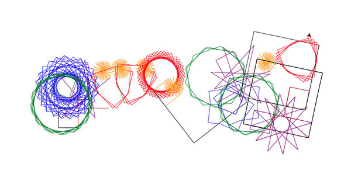

<<<<<<< HEAD
# Computer Vision - Human-like Interface 

=======
# computer_vision--hand_gesture_recognition

This project aims to create a more human-like interface by which an operator will intuitively interact with edge devices.   The MVP will use nine ASL-based hand gestures and computer vision to control a python program. 
>>>>>>> d729aaad4c224c5116e21285735723de2e15aab9

# Statement:

This project aims to create a more human-like interface by which an operator will intuitively interact with edge devices.   The MVP will use nine ASL-based hand gestures and computer vision to control a python program. 

**Goals:**
1. Train a convolutional neural network to identify particular ASL-based hand gestures (9 classes).
2. Create code that will trigger actions within an external program when above classes are recodnized.

# Executive Summary:

**Data**

-  The model is trained on nine distinct hand gestures based on the ASL alphabet.  
- The collected data is from an open-source online archive, webcam screen shoot, and cameraphone images of 15 volunteers.
- There was a conscious effort to ensure that samples represent individuals of various ethnic backgrounds.   
- We resized all file sizes and proportions to 412 x 412. 
- Roboflow.com was utilized for Data augmentation to increase the training data set. 

**Model**

- The CNN model of choice is Tiny YoloV4 on Darknet framework.  Tiny YoloV4 model has a weight-set of only 23mb but still returned a 40.2 % AP50 score on MS COCO Object Detection dataset.   
   
- The model was trained and tuned on Google Colab using the architecture file (cfg) achiving a model with 92.96 mAP. 
    

**Detection**

The architecture and the weight file were placed into an OpenCV script, utilizing OpenCV DNN libraries to run real-time detection of the gestures through the computer's webcam. (detect.ipynb) 
    
**Linked python program**
    
The python program turtle_test3.py is a python script running events based on turtle.py libraries.  The detect.ipynb writes to the file Move-2.txt  when a gesture is detected.  The turtle_test3.py program is constantly reading this file, waiting for an update that will cause it to execute a function; change the turtle color and draw a new geometric.
   - [turtle.py](https://docs.python.org/3/library/turtle.html)

    

 

#### Metrics of tiny YoloV4 model 
| class          | Average Precision    | TP    |  FP |
| :------------- | :----------: | :----------: |-----------: |
|  foward | 90.00  | 9   | 2|
|  back | 100  | 10  | 0|
|  left| 83.33  | 5   | 0|
|  right| 91.82  | 10   | 2|
|  input| 90  | 5   | 1|
|  plus| 81.48  | 8   | 1|
|  three| 100  | 5   | 2|
|  seven | 100  | 7   | 1|
|five | 100| 2 |0 \||

| Average mean precision (mAP)         |recall    | precision   | F1-score |
| :------------- | :----------: | :----------: |-----------: |
|  92.96 | 0.91  | 0.87   | 0.89|

  
Hand gesture recognized by model.

     
     

 

     This image is a screen capture of a drawing created from the computer vision model within the OpenCV code. 

## Contents

- Code 
    - Balance_classes.ipynb
    - convert_class_of_txt.ipynb
    - detect.ipynb
    - file_structure-yoloV4.ipynb
    - main.ipynb
    - move-2.txt
    - re-size-for-HD.ipynb
    - screen_grab.ipynb
    - turtle_test.ipynb
    - turtle_test3.py
    - weights-cfg FOLDER
        - classes.names
        - yolov4_tiny_test.cfg
        - yolov4_tiny_train.cfg
        - yolov4_tiny_train_best.weights
        - yolov4_tiny_train_last.weights
    - WP04_Yolov4_turtle_tiny_sub4_newdata.ipynb

## Conclusion

In conclusion, the Tiny YoloV4 model is successful in being able to identify particular hand gestures after being trained on custom data. With the low computational cost of running a Tiny Yolov4 it can run on a CPU in real-time. The detection of particular hand gestures was able to trigger actions within another program.

## Areas of Future Studies

To grow this model, we are looking into creating better scripts & tools for managing data workflows and collect data with more variety of hand sizes.  An example of this is a smartphone app that allows seamless labeling and image augmentation within your photo library. We are also looking into Mediapipe and other gesture models that incorporate more significant movements of the body.

## Areas of further philosophical thought

We will research concepts of what will the future of computer vision hold. I can see a time when computers will intuit human gestures by passively collecting data from watching us, just as the search engine customizes and intuits our needs based on past searches we have done.  Cameras linked to computer vision systems will be ubiquitous in the future. A computer network will better understand your mood & intentions based on gentle shifts in your body language than your intimate partner or the family dog.  Will this data be centralized on cloud serves or decentralized on personal home servers?  What rules will be in place to keep this data private so that employers nor advertising companies do not leverage this knowledge?

--- 
       
   

---

# Community notes
- Below are notes from the yolo community that are most helpful when creating a model. 
- One of the greatest strengths of the yolo model is the Open-source community that supports it.

#### About YoloV4 tiny 

https://github.com/AlexeyAB/darknet/issues/6067

---

### People to reconize in the comunity

Yashas Samaga B L

Worked to create YOLOv4 inference using OpenCV DNN 

https://gist.github.com/YashasSamaga/e2b19a6807a13046e399f4bc3cca3a49

---

### Hyperparameters

https://github.com/AlexeyAB/darknet/wiki/CFG-Parameters-in-the-%5Bnet%5D-section

---

## Best Practices for training 

#### Below are notes from   https://github.com/AlexeyAB/darknet#How-to-improve-object-detection

- Check that each object that you want to detect is mandatory labeled in your dataset - no one object in your data set should not be without label. In the most training issues - there are wrong labels in your dataset (got labels by using some conversion script, marked with a third-party tool, ...). Always check your dataset by using: https://github.com/AlexeyAB/Yolo_mark

- for each object which you want to detect - there must be at least 1 similar object in the Training dataset with about the same: shape, side of object, relative size, angle of rotation, tilt, illumination. So desirable that your training dataset include images with objects at diffrent: scales, rotations, lightings, from different sides, on different backgrounds - you should preferably have 2000 different images for each class or more, and you should train 2000*classes iterations or more

- desirable that your training dataset include images with non-labeled objects that you do not want to detect - negative samples without bounded box (empty .txt files) - use as many images of negative samples as there are images with objects

- If you train the model to distinguish Left and Right objects as separate classes (left/right hand, left/right-turn on road signs, ...) then for disabling flip data augmentation - add flip=0 here: https://github.com/AlexeyAB/darknet/blob/3d2d0a7c98dbc8923d9ff705b81ff4f7940ea6ff/cfg/yolov3.cfg#L17

- General rule - your training dataset should include such a set of relative sizes of objects that you want to detect:

    train_network_width * train_obj_width / train_image_width ~= detection_network_width * detection_obj_width / detection_image_width
    train_network_height * train_obj_height / train_image_height ~= detection_network_height * detection_obj_height / detection_image_height

I.e. for each object from Test dataset there must be at least 1 object in the Training dataset with the same class_id and about the same relative size:

object width in percent from Training dataset ~= object width in percent from Test dataset

That is, if only objects that occupied 80-90% of the image were present in the training set, then the trained network will not be able to detect objects that occupy 1-10% of the image.

- each: model of object, side, illimination, scale, each 30 grad of the turn and inclination angles - these are different objects from an internal perspective of the neural network. So the more different objects you want to detect, the more complex network model should be used.

- to make the detected bounded boxes more accurate, you can add 3 parameters ignore_thresh = .9 iou_normalizer=0.5 iou_loss=giou to each [yolo] layer and train, it will increase mAP@0.9, but decrease mAP@0.5.

After training - for detection:

- Increase network-resolution by set in your .cfg-file (height=608 and width=608) or (height=832 and width=832) or (any value multiple of 32) - this increases the precision and makes it possible to detect small objects: link

#### About anchers

- https://github.com/pjreddie/darknet/issues/911

- Only if you are an expert in neural detection networks - recalculate anchors for your dataset for width and height from cfg-file: darknet.exe detector calc_anchors data/obj.data -num_of_clusters 9 -width 416 -height 416 then set the same 9 anchors in each of 3 [yolo]-layers in your cfg-file. But you should change indexes of anchors masks= for each [yolo]-layer, so for YOLOv4 the 1st-[yolo]-layer has anchors smaller than 30x30, 2nd smaller than 60x60, 3rd remaining, and vice versa for YOLOv3. Also you should change the filters=(classes + 5)*<number of mask> before each [yolo]-layer. If many of the calculated anchors do not fit under the appropriate layers - then just try using all the default anchors.

#### Mosaic Augmentation Paper? #8

https://github.com/WongKinYiu/CrossStagePartialNetworks/issues/8
